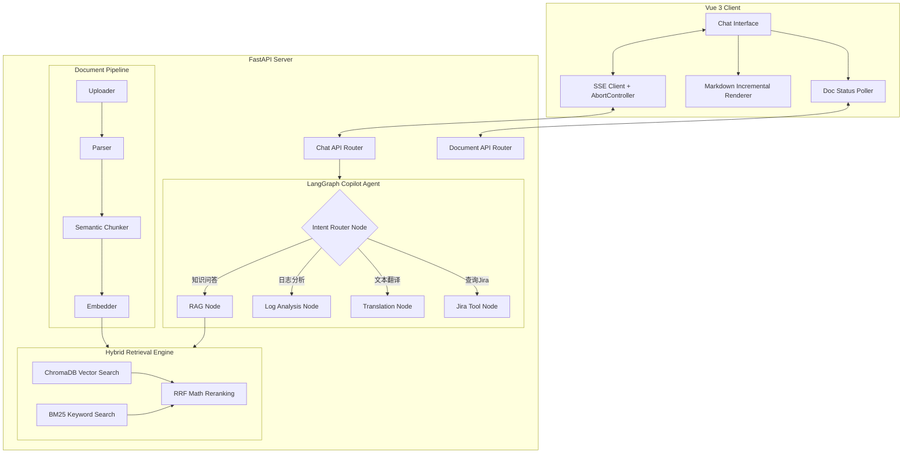

# 技术设计文档：Copilot-transformation

## Overview
本阶段 (MVP) 的技术架构将在原有的 FastAPI + Vue3 基础上进行扩展。核心的改变发生在后端的 Agent 编排层和检索增强层，以及前端的交互体验优化。

**技术栈变更与扩展：**
- **后端 Agent 框架**：深入使用 `langgraph` 实现多节点状态机路由。
- **检索增强**：在 `chromadb` 基础上引入 `rank_bm25` 库实现混合检索，引入本地轻量级重排（或 Prompt 重排）。
- **文档处理**：引入 `langchain-text-splitters` 处理更复杂的语义切分；引入 `pandas` 和 `openpyxl` 将 xlsx 文件按行展开为结构化文本。
- **前端优化**：基于 `AbortController` 实现 Fetch API 级别的流式中断；引入 `marked` 的增量渲染或节流策略优化 DOM 性能。

## Architecture

### 系统架构图

## Components and Interfaces

### 1. LangGraph Agent (核心工作流重构)
- **`CopilotState (TypedDict)`**: 扩展原有的 `RAGState`，增加 `intent`（意图）、`tool_calls`（工具调用记录）等字段。
- **意图路由节点 (`_router_node`)**: 
  - 使用 LLM 调用（带特定的 System Prompt 或 Function Calling）分析用户的 `question`，返回确定的意图枚举值（如 `rag`, `log`, `translate`, `jira`）。
- **工具调用节点 (`_jira_node`)**:
  - 实现一个 Mock 的 Jira API 客户端，接收提取出的 Jira ID，返回 Mock 的任务状态和描述。
- **统一流式输出 (`CopilotService.answer`)**:
  - 重构 `RAGService.answer`，使其能接收任意节点结束后的 `messages` 状态，并统一通过 SSE 流式推送到前端。

### 2. 混合检索与重排 (Hybrid Retrieval Engine)
- **`BM25Retriever`**: 新增组件，在文档切分入库时，同步维护一份基于 `rank_bm25` 的内存/本地倒排索引。
- **`HybridRetriever.retrieve`**:
  - 接口签名：`retrieve(query: str, top_k: int) -> list[ChunkResult]`
  - 内部逻辑：分别调用向量检索和 BM25 检索，获取 Top-N 结果并去重。
- **`Embedder` 扩展**:
  - 增加 `EMBEDDING_API_URL` 和 `EMBEDDING_API_KEY` 独立环境变量配置，支持接入不同于对话大模型厂商的 Embedding 模型（需兼容 OpenAI 格式），以替代缓慢的本地 CPU 模型。
- **`Reranker` (RRF 倒数秩融合)**: 
  - 接收去重后的 Chunk 列表，放弃高延迟的大模型重排，改用数学倒数秩融合 (Reciprocal Rank Fusion, RRF) 算法。
  - 公式：`Score = 1 / (K + Rank_Vector) + 1 / (K + Rank_BM25)`，其中 K 通常取 60。
  - 按得分降序排列，取 Top-K 返回。
  - `ChunkResult` 模型新增 `similarity_score: float` 字段用于存储融合得分。

### 3. 语义切分 (Semantic Chunker)
- **`Chunker` 类重构**:
  - 增加 `chunk_markdown(doc: ParsedDocument)` 方法，利用 `MarkdownHeaderTextSplitter` 按标题切分。
  - 增加 `chunk_text(doc: ParsedDocument)` 方法，利用 `RecursiveCharacterTextSplitter` 优先按 `\n\n` 切分。
  - 根据 `doc.file_type` 动态路由到不同的切分策略。

### 4. 前端交互体验优化
- **中断与重新生成 (`chat.ts` Store)**:
  - 引入 `AbortController`。在发起 `sendMessage` 请求时创建实例，将 `signal` 传给底层 `fetch`。
  - 暴露 `stopStream()` 方法调用 `abort()`，并处理 `AbortError`。
  - 暴露 `regenerate(messageIndex)` 方法，截断历史记录并重新调用 `sendQuestion`。
- **流式渲染性能 (`MessageBubble.vue`)**:
  - 引入 `requestAnimationFrame` 或 Lodash `throttle`，限制 Markdown 全量解析的频率（例如每 100ms 解析一次，而不是每个 Token 解析一次）。
- **相似度可视化**:
  - 更新 `SourceRef` 类型，包含 `similarityScore`。在 `MessageBubble.vue` 的来源列表中，展示该分数的 Badge。

### 5. 文档解析进度 (Document API & UI)
- **数据库扩展**: `documents` 表/实体新增 `status` 字段（`pending`, `parsing`, `chunking`, `completed`, `failed`）。
- **API**: 新增 `GET /api/documents/status` 接口，支持批量查询文档状态。
- **前端 (`DocumentList.vue`)**: 挂载定时器（如每 3 秒），当列表中存在非 `completed`/`failed` 状态的文档时，轮询状态接口并更新 UI。