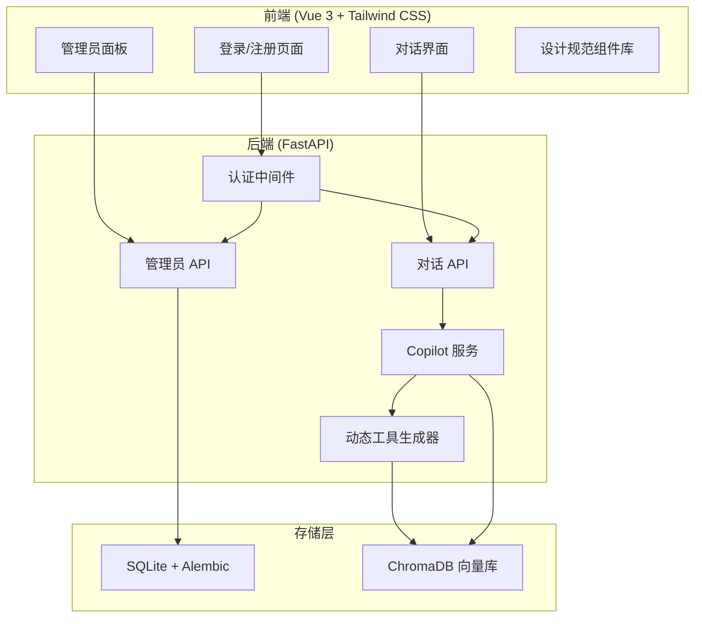

# QA Copilot MVP4 - 技术设计文档

## 1. 系统架构

### 1.1 架构概览



### 1.2 核心变更

| 模块 | MVP3 | MVP4 |
|------|------|------|
| 知识库分类 | 硬编码 `default/translation/log` | 数据库动态管理 |
| 检索工具 | 3 个固定工具 | 动态生成 N 个工具 |
| 系统提示词 | 固定文本 | 动态包含分类描述 |
| 前端样式 | 无统一规范 | 设计规范 + 组件库 |

---

## 2. 数据模型设计

### 2.1 新增表：`kb_category`（知识库分类）

```python
# backend/app/models/kb_category.py

class KbCategory(Base):
    """知识库分类模型"""
    __tablename__ = "kb_categories"

    id: Mapped[str] = mapped_column(primary_key=True)
    name: Mapped[str] = mapped_column(unique=True, index=True)  # 分类名称（如 qa-docs）
    description: Mapped[str] = mapped_column(nullable=True)      # 分类描述
    created_at: Mapped[datetime] = mapped_column(default=datetime.utcnow)
    updated_at: Mapped[datetime] = mapped_column(onupdate=datetime.utcnow)
    created_by: Mapped[str] = mapped_column(ForeignKey("users.id"))  # 创建者（管理员）

    # 关联文档
    documents: Mapped[list["Document"]] = relationship(back_populates="kb_category")
```

### 2.2 修改表：`documents`（文档）

```python
# backend/app/models/document.py 修改

class Document(Base):
    # 新增外键关联
    kb_category_id: Mapped[str] = mapped_column(
        ForeignKey("kb_categories.id"), 
        nullable=False,
        default="default"  # 默认分类
    )
    kb_category: Mapped["KbCategory"] = relationship(back_populates="documents")
    
    # 移除旧的 kb_category 字符串字段
    # kb_category: Mapped[str] = mapped_column(default="default")  # 删除
```

### 2.3 数据库迁移

```bash
# Alembic 迁移脚本
alembic revision --autogenerate -m "add_kb_categories_table"
alembic upgrade head
```

**迁移逻辑**：
1. 创建 `kb_categories` 表
2. 插入默认分类（`default`, `translation`, `log`）
3. 修改 `documents` 表，添加外键
4. 将现有文档的 `kb_category` 字符串映射到新外键

---

## 3. API 设计

### 3.1 知识库分类管理 API（管理员专属）

| 接口 | 方法 | 描述 |
|------|------|------|
| `/api/admin/categories` | GET | 获取所有分类列表 |
| `/api/admin/categories` | POST | 创建新分类 |
| `/api/admin/categories/{id}` | PUT | 更新分类名称/描述 |
| `/api/admin/categories/{id}` | DELETE | 删除空分类 |

#### 创建分类请求体

```json
{
  "name": "qa-docs",
  "description": "QA 相关文档，包括测试规范、流程文档等"
}
```

#### 分类列表响应

```json
{
  "items": [
    {
      "id": "cat-001",
      "name": "qa-docs",
      "description": "QA 相关文档",
      "document_count": 5,
      "created_at": "2026-04-02T10:00:00Z"
    }
  ]
}
```

### 3.2 文档管理 API（管理员专属）

| 接口 | 方法 | 描述 |
|------|------|------|
| `/api/documents?category={id}` | GET | 按分类筛选文档列表 |
| `/api/documents/{id}/category` | PUT | 移动文档到其他分类 |

#### 移动文档请求体

```json
{
  "category_id": "cat-002"
}
```

### 3.3 权限校验

所有管理 API 使用 `require_admin` 依赖：

```python
@router.post("/api/admin/categories")
async def create_category(
    data: CategoryCreate,
    admin: User = Depends(require_admin)  # 校验管理员权限
):
    ...
```

---

## 4. 动态工具生成设计

### 4.1 工具生成器

```python
# backend/app/services/tool_generator.py

class ToolGenerator:
    """根据数据库分类动态生成检索工具"""
    
    def __init__(self, retriever: HybridRetriever, db: Session):
        self._retriever = retriever
        self._db = db
    
    def build_retrieve_tools(self) -> list[StructuredTool]:
        """生成所有知识库检索工具"""
        categories = self._db.query(KbCategory).all()
        tools = []
        
        for cat in categories:
            tool = self._create_tool_for_category(cat)
            tools.append(tool)
        
        return tools
    
    def _create_tool_for_category(self, cat: KbCategory) -> StructuredTool:
        """为单个分类创建检索工具"""
        
        @tool(response_format="content_and_artifact")
        async def retrieve_xxx_kb(query: str) -> tuple[str, list[dict]]:
            """从 {cat.description} 中检索相关文档。
            
            适用场景：当用户询问与 {cat.name} 相关的问题时使用此工具。
            """
            chunks = await self._retriever.retrieve(
                query, 
                top_k=5, 
                filter={"kb_category_id": cat.id}
            )
            ...
        
        return retrieve_xxx_kb
```

### 4.2 系统提示词动态生成

```python
# backend/app/services/copilot_prompts.py

def build_system_prompt(categories: list[KbCategory]) -> str:
    """动态生成系统提示词"""
    
    category_guide = "\n".join([
        f"- {cat.name}: {cat.description}" 
        for cat in categories
    ])
    
    return f"""你是一个智能的 QA Copilot 助手。

可用知识库分类：
{category_guide}

知识库选择规则：
1. 根据用户问题主题，选择最匹配的知识库工具
2. 如果不确定，优先使用 default 分类
3. 只有明确涉及翻译术语时，才使用 translation 分类
4. 只有明确涉及系统日志/错误分析时，才使用 log 分类

Jira 工具使用指南:
...
"""
```

### 4.3 Copilot 服务改造

```python
# backend/app/services/copilot_service.py

class CopilotService:
    def _build_agent(self) -> Any:
        """构建 ReAct Agent（动态工具）"""
        db = SessionLocal()
        categories = db.query(KbCategory).all()
        db.close()
        
        # 动态生成工具
        tools = ToolGenerator(self._retriever, db).build_retrieve_tools()
        # 添加 Jira 工具
        tools.extend(build_jira_tools(self._jira_client))
        
        # 动态生成提示词
        prompt = build_system_prompt(categories)
        
        return create_react_agent(self._llm_client.model, tools, prompt=prompt)
```

---

## 5. 前端设计规范

### 5.1 颜色体系

```css
/* 主色调 - 科技蓝 */
--color-primary: #3B82F6;       /* 主色 */
--color-primary-light: #60A5FA; /* 浅主色 */
--color-primary-dark: #1D4ED8;  /* 深主色 */

/* 辅助色 */
--color-secondary: #64748B;     /* 辅助灰 */

/* 状态色 */
--color-success: #10B981;       /* 成功绿 */
--color-warning: #F59E0B;       /* 警告橙 */
--color-error: #EF4444;         /* 错误红 */

/* 背景色 */
--color-bg: #F8FAFC;            /* 页面背景 */
--color-bg-card: #FFFFFF;       /* 卡片背景 */
--color-bg-hover: #F1F5F9;      /* 悬停背景 */

/* 文本色 */
--color-text: #1E293B;          /* 正文 */
--color-text-secondary: #64748B; /* 辅助文本 */
--color-text-muted: #94A3B8;    /* 禁用文本 */
```

### 5.2 字体规范

```css
/* 字号层级 */
--font-size-xs: 12px;    /* 辅助文本 */
--font-size-sm: 14px;    /* 小号文本 */
--font-size-base: 16px;  /* 正文 */
--font-size-lg: 18px;    /* 大号文本 */
--font-size-xl: 20px;    /* 标题 */
--font-size-2xl: 24px;   /* 大标题 */

/* 字重 */
--font-weight-normal: 400;
--font-weight-medium: 500;
--font-weight-semibold: 600;
--font-weight-bold: 700;
```

### 5.3 间距规范

```css
/* 基于 4px 的间距体系 */
--spacing-1: 4px;
--spacing-2: 8px;
--spacing-4: 16px;
--spacing-6: 24px;
--spacing-8: 32px;
```

### 5.4 圆角规范

```css
--radius-sm: 4px;   /* 按钮、标签 */
--radius-md: 8px;   /* 输入框、卡片 */
--radius-lg: 12px;  /* 大卡片、模态框 */
--radius-full: 9999px; /* 圆形头像 */
```

### 5.5 组件设计

#### 卡片组件

```vue
<!-- 统一卡片样式 -->
<div class="bg-white rounded-lg border border-gray-200 shadow-sm p-4">
  <!-- 内容 -->
</div>
```

#### 按钮组件

```vue
<!-- 主按钮 -->
<button class="bg-primary text-white px-4 py-2 rounded-md hover:bg-primary-dark transition-colors">
  提交
</button>

<!-- 辅助按钮 -->
<button class="bg-gray-100 text-gray-700 px-4 py-2 rounded-md hover:bg-gray-200 transition-colors">
  取消
</button>
```

#### Toast 组件

```vue
<!-- 成功提示 -->
<div class="fixed bottom-4 right-4 bg-success text-white px-4 py-3 rounded-lg shadow-lg animate-slide-up">
  操作成功
</div>
```

---

## 6. 前端页面改造

### 6.1 页面清单

| 页面 | 改造内容 |
|------|---------|
| `LoginView.vue` | 统一按钮/输入框样式，添加加载动画 |
| `ChatView.vue` | 优化对话界面布局，消息气泡样式 |
| `KnowledgeSourcesView.vue` | 新增分类管理面板，文档列表筛选 |
| `ObservabilityView.vue` | 统一表格/卡片样式 |
| `App.vue` | 全局布局优化，导航栏样式 |

### 6.2 新增组件

| 组件 | 功能 |
|------|------|
| `CategoryManager.vue` | 知识库分类管理面板（管理员） |
| `CategorySelect.vue` | 分类选择下拉框 |
| `Toast.vue` | 全局提示组件 |
| `LoadingSpinner.vue` | 统一加载动画 |
| `EmptyState.vue` | 空状态引导组件 |

### 6.3 前端路由调整

```typescript
// frontend/src/router/index.ts

const routes = [
  { path: '/login', component: LoginView },
  { path: '/register', component: RegisterView },
  { path: '/', component: ChatView, meta: { requiresAuth: true } },
  { 
    path: '/knowledge', 
    component: KnowledgeSourcesView, 
    meta: { requiresAuth: true, requiresAdmin: true }  // 管理员专属
  },
  { 
    path: '/observability', 
    component: ObservabilityView, 
    meta: { requiresAuth: true, requiresAdmin: true }
  },
]
```

---

## 7. 关键实现细节

### 7.1 分类数量限制

```python
MAX_CATEGORIES = 20

async def create_category(data: CategoryCreate, db: Session):
    count = db.query(KbCategory).count()
    if count >= MAX_CATEGORIES:
        raise HTTPException(400, "分类数量已达上限（20个）")
    ...
```

### 7.2 删除分类检查

```python
async def delete_category(category_id: str, db: Session):
    cat = db.get(KbCategory, category_id)
    if cat.documents.count() > 0:
        raise HTTPException(400, "分类下仍有文档，请先迁移或删除文档")
    ...
```

### 7.3 工具命名规范

```python
def _create_tool_name(category_name: str) -> str:
    """生成工具名称，如 retrieve_qa_docs_kb"""
    safe_name = category_name.lower().replace("-", "_").replace(" ", "_")
    return f"retrieve_{safe_name}_kb"
```

---

## 8. 测试设计

### 8.1 后端测试

| 测试文件 | 测试内容 |
|---------|---------|
| `test_kb_category.py` | 分类 CRUD API、权限校验 |
| `test_tool_generator.py` | 动态工具生成逻辑 |
| `test_category_api.py` | 管理员 API 权限测试 |

### 8.2 前端测试

| 测试内容 | 测试方式 |
|---------|---------|
| 分类管理组件 | 组件单元测试 |
| 权限路由守卫 | 路由测试 |
| Toast 反馈 | 组件交互测试 |

---

## 9. 文件变更清单

### 新增文件

| 文件 | 描述 |
|------|------|
| `backend/app/models/kb_category.py` | 分类数据模型 |
| `backend/app/api/categories.py` | 分类管理 API |
| `backend/app/services/tool_generator.py` | 动态工具生成器 |
| `backend/alembic/versions/xxx_add_kb_categories.py` | 数据库迁移 |
| `frontend/src/components/CategoryManager.vue` | 分类管理组件 |
| `frontend/src/components/CategorySelect.vue` | 分类选择组件 |
| `frontend/src/components/Toast.vue` | 提示组件 |

### 修改文件

| 文件 | 改动 |
|------|------|
| `backend/app/models/document.py` | 添加分类外键 |
| `backend/app/services/copilot_service.py` | 动态工具加载 |
| `backend/app/services/copilot_prompts.py` | 动态提示词生成 |
| `backend/app/services/copilot_tools.py` | 重构为动态生成 |
| `frontend/src/router/index.ts` | 添加管理员路由守卫 |
| `frontend/src/views/*.vue` | 应用新设计规范 |