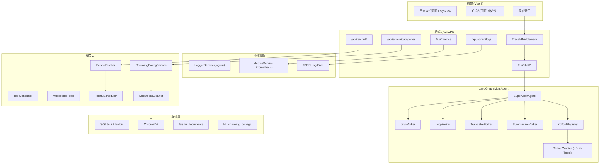

# QA Copilot MVP5 - 技术设计文档

## 1. 系统架构

### 1.1 架构概览



---

## 2. 数据模型设计

### 2.1 新增表：`feishu_documents`

```python
# backend/app/models/feishu_document.py

class FeishuDocument(Base):
    """飞书文档映射表"""
    __tablename__ = "feishu_documents"

    id: Mapped[str] = mapped_column(primary_key=True)
    feishu_doc_url: Mapped[str] = mapped_column(unique=True, index=True)
    feishu_doc_type: Mapped[str]  # "doc" | "sheet" | "bitable"
    title: Mapped[str]
    kb_category_id: Mapped[str] = mapped_column(ForeignKey("kb_categories.id"))
    last_fetched_at: Mapped[datetime | None]
    is_active: Mapped[bool] = mapped_column(default=True)
    sync_interval_hours: Mapped[int] = mapped_column(default=24)
    sync_cron_hour: Mapped[int] = mapped_column(default=-1)  # -1=不使用定时
    last_sync_status: Mapped[str] = mapped_column(default="pending")
    last_sync_error: Mapped[str | None]
    created_at: Mapped[datetime] = mapped_column(default=datetime.utcnow)
    updated_at: Mapped[datetime] = mapped_column(onupdate=datetime.utcnow)
```

### 2.2 新增表：`kb_chunking_configs`

```python
# backend/app/models/chunking_config.py

class KbChunkingConfig(Base):
    """知识库分类的切分策略配置"""
    __tablename__ = "kb_chunking_configs"

    id: Mapped[str] = mapped_column(primary_key=True)
    category_id: Mapped[str] = mapped_column(ForeignKey("kb_categories.id"), unique=True)
    chunking_strategy: Mapped[str] = mapped_column(default="recursive_text")
    max_tokens: Mapped[int] = mapped_column(default=512)
    overlap: Mapped[int] = mapped_column(default=50)
    strategy_overrides: Mapped[dict | None] = mapped_column(JSONB, nullable=True)
    # 示例: {"pdf": "semantic", "docx": "recursive_text"}
    created_at: Mapped[datetime] = mapped_column(default=datetime.utcnow)
    updated_at: Mapped[datetime] = mapped_column(onupdate=datetime.utcnow)
    category: Mapped["KbCategory"] = relationship(back_populates="chunking_config")
```

### 2.3 修改表：`documents`

```python
# backend/app/models/document.py - Document 类新增字段

deleted_at: Mapped[datetime | None]  # 软删除
feishu_doc_id: Mapped[str | None] = mapped_column(index=True)  # 关联飞书文档
```

### 2.4 修改表：`kb_categories`

```python
# backend/app/models/kb_category.py - KbCategory 类新增关系

chunking_config: Mapped["KbChunkingConfig"] = relationship(
    back_populates="category",
    uselist=False,
    cascade="all, delete-orphan",
)
```

---

## 3. API 设计

### 3.1 日志查询 API

```
GET /api/admin/logs
```

**查询参数：**
| 参数 | 类型 | 说明 |
|------|------|------|
| level | string | 筛选级别（INFO/ERROR/WARNING） |
| trace_id | string | 按 trace_id 精确查找 |
| from | datetime | 开始时间 |
| to | datetime | 结束时间 |
| limit | int | 返回条数（默认100） |

**响应：**
```json
{
  "items": [
    {
      "time": "2026-04-07T10:00:00.000Z",
      "level": "INFO",
      "name": "app.services.uploader",
      "function": "process_document",
      "line": 42,
      "trace_id": "a1b2c3d4-...",
      "message": "Document processing started"
    }
  ]
}
```

### 3.2 Metrics API

```
GET /api/metrics
```

**响应：** Prometheus text format

### 3.3 飞书文档 API

| 接口 | 方法 | 描述 |
|------|------|------|
| `/api/feishu/documents` | POST | 注册飞书文档 |
| `/api/feishu/documents` | GET | 查看已注册文档列表 |
| `/api/feishu/documents/{id}` | GET | 查看单个文档详情 |
| `/api/feishu/documents/{id}` | PUT | 更新拉取配置 |
| `/api/feishu/documents/{id}` | DELETE | 软删除 |
| `/api/feishu/documents/{id}/sync` | POST | 手动触发拉取 |
| `/api/feishu/sync-all` | POST | 手动触发全部拉取 |

**注册请求体：**
```json
{
  "feishu_doc_url": "https://feishu.cn/docx/xxx",
  "feishu_doc_type": "doc",
  "title": "文档标题（用户手动输入）",
  "kb_category_id": "cat-xxx",
  "sync_interval_hours": 24,
  "sync_cron_hour": 2
}
```
> 注意：后端不解析 URL 获取标题/类型，需用户手动输入

### 3.4 切分配置 API

| 接口 | 方法 | 描述 |
|------|------|------|
| `/api/admin/categories/{id}/chunking-config` | PUT | 更新切分策略配置 |
| `/api/admin/categories/{id}/chunking-config` | GET | 获取切分策略配置 |

**请求体：**
```json
{
  "chunking_strategy": "semantic",
  "max_tokens": 512,
  "overlap": 50,
  "strategy_overrides": {"pdf": "semantic", "docx": "recursive_text"}
}
```

---

## 4. 服务设计

### 4.1 LoggerService

```python
# backend/app/services/logger.py

from contextvars import ContextVar
from loguru import logger
from pathlib import Path

_trace_id_var: ContextVar[str] = ContextVar("trace_id", default="no-trace")

def setup_logging() -> None:
    """配置 loguru 日志系统"""
    logger.remove()
    logger.add(
        sink=Path(settings.log_dir) / "app_{time:YYYY-MM-DD}.log",
        rotation=settings.log_rotation,
        retention=settings.log_retention,
        format="{time:ISO} | {level: <8} | {name}:{function}:{line} | {extra[trace_id]} | {message}",
        serialize=True,  # JSON 格式
        level=settings.log_level,
        enqueue=True,
    )

def get_logger(name: str):
    return logger.bind(trace_id=_trace_id_var.get())

def set_trace_id(trace_id: str) -> None:
    _trace_id_var.set(trace_id)
```

### 4.2 TraceIdMiddleware

```python
# backend/app/middleware/trace_id.py

class TraceIdMiddleware(BaseHTTPMiddleware):
    async def dispatch(self, request: Request, call_next):
        trace_id = request.headers.get("X-Trace-ID", str(uuid.uuid4()))
        set_trace_id(trace_id)
        response = await call_next(request)
        response.headers["X-Trace-ID"] = trace_id
        return response
```

### 4.3 MetricsService

```python
# backend/app/services/metrics.py

from prometheus_client import Counter, Histogram, Gauge, generate_latest, CONTENT_TYPE_LATEST

copilot_requests_total = Counter("copilot_requests_total", "Total copilot requests")
copilot_request_duration = Histogram("copilot_request_duration_seconds", "Request duration")
tool_calls_total = Counter("tool_calls_total", "Tool calls", ["tool_name"])
document_processing_total = Counter("document_processing_total", "Document processing", ["status"])
document_processing_duration = Histogram("document_processing_duration_seconds", "Document processing duration")
jira_queries_total = Counter("jira_queries_total", "Jira queries", ["status"])
active_sessions = Gauge("active_sessions", "Active sessions")
```

### 4.4 DocumentCleaner

```python
# backend/app/services/cleaner.py

class DocumentCleaner:
    def clean(self, text: str) -> str:
        text = self._remove_html(text)
        text = self._remove_special_chars(text)
        text = self._normalize_whitespace(text)
        text = self._filter_noise_lines(text)
        return text.strip()

    def _remove_html(self, text: str) -> str:
        from bs4 import BeautifulSoup
        soup = BeautifulSoup(text, "html.parser")
        return soup.get_text(separator=" ", strip=True)

    def _remove_special_chars(self, text: str) -> str:
        import re
        # 零宽字符
        text = re.sub(r'[\u200b\u200c\u200d\ufeff]', '', text)
        # 控制字符（排除 \n \r \t）
        text = re.sub(r'[\x00-\x08\x0b\x0c\x0e-\x1f]', '', text)
        return text

    def _normalize_whitespace(self, text: str) -> str:
        import re
        text = re.sub(r'[ \t]+', ' ', text)
        text = re.sub(r'\n{3,}', '\n\n', text)
        return text

    def _filter_noise_lines(self, text: str) -> str:
        import re
        lines = text.split('\n')
        filtered = []
        for line in lines:
            line = line.strip()
            if not line:
                continue
            # 过滤纯数字行
            if re.match(r'^[\d\s]+$', line) and len(line) < 10:
                continue
            # 过滤单字符行
            if len(line) == 1 and not re.match(r'[\u4e00-\u9fff]', line):
                continue
            filtered.append(line)
        return '\n'.join(filtered)
```

### 4.5 Chunker 改造

```python
# backend/app/services/chunker.py

class Chunker:
    # 保留原有方法，添加新策略

    def chunk_with_config(self, doc: ParsedDocument, config: KbChunkingConfig) -> list[Chunk]:
        """使用分类配置进行切分"""
        # 1. 查 strategy_overrides
        strategy = config.strategy_overrides.get(doc.file_type) if config.strategy_overrides else None
        # 2. 无则用默认策略
        strategy = strategy or config.chunking_strategy
        # 3. 调用对应方法
        return self._chunk_by_strategy(doc, strategy, config.max_tokens, config.overlap)

    def _chunk_by_strategy(self, doc, strategy, max_tokens, overlap):
        if strategy == "semantic":
            return self._chunk_semantic(doc, max_tokens, overlap)
        elif strategy == "sentence":
            return self._chunk_sentence(doc, max_tokens, overlap)
        elif strategy == "sliding_window":
            return self._chunk_sliding_window(doc, max_tokens, overlap)
        elif strategy == "markdown":
            return self._chunk_markdown(doc, max_tokens, overlap)
        elif strategy == "excel":
            return self._chunk_excel(doc, max_tokens, overlap)
        else:
            return self._chunk_text(doc, max_tokens, overlap)

    def _chunk_semantic(self, doc, max_tokens, overlap) -> list[Chunk]:
        """
        基于 embeddings 相似度的语义切分。

        真实实现逻辑：
        1. 用标点将文本拆分为候选句子
        2. 将连续句子合并为候选 chunk（不超过 max_tokens）
        3. 对每个 chunk 调用 Embedder.embed([chunk]) 获取向量
        4. 计算连续 chunk 之间的余弦相似度
        5. 当相似度突然下降 > 阈值（如 0.3）时，断开作为新的语义段落
        6. overlap：保留上一个 chunk 的最后 1-2 个句子到下一个 chunk
        """
        from app.services.embedder import Embedder
        embedder = Embedder()
        import re
        sentence_pattern = r"(?<=[。！？.?!])\s+"
        sentences = re.split(sentence_pattern, doc.content)

        chunks = []
        current_chunk = []
        current_tokens = 0
        position = 0
        prev_embedding = None

        for sentence in sentences:
            if not sentence.strip():
                continue
            sentence_tokens = len(self._enc.encode(sentence))

            if current_tokens + sentence_tokens > max_tokens and current_chunk:
                # 评估当前 chunk：计算 embedding 并与上一个 chunk 比较
                chunk_text = "".join(current_chunk)
                chunk_embedding = embedder.embed([chunk_text])[0]

                if prev_embedding is not None:
                    similarity = self._cosine_similarity(prev_embedding, chunk_embedding)
                    # 如果相似度骤降 > 阈值，标记新段落开始
                    # 但这个判断在有足够 chunks 后才生效，首次不触发
                    pass

                chunks.append(self._make_chunk(doc, current_chunk, position))
                position += 1
                prev_embedding = chunk_embedding

                # 处理 overlap：保留最后 1-2 个句子
                if overlap > 0:
                    overlap_tokens = 0
                    overlap_sentences = []
                    for s in reversed(current_chunk):
                        s_tokens = len(self._enc.encode(s))
                        if overlap_tokens + s_tokens <= overlap:
                            overlap_sentences.insert(0, s)
                            overlap_tokens += s_tokens
                        else:
                            break
                    current_chunk = overlap_sentences
                    current_tokens = overlap_tokens
                else:
                    current_chunk = []
                    current_tokens = 0

            current_chunk.append(sentence)
            current_tokens += sentence_tokens

        if current_chunk:
            chunks.append(self._make_chunk(doc, current_chunk, position))

        return chunks

    def _cosine_similarity(self, a: list[float], b: list[float]) -> float:
        """计算两个向量的余弦相似度"""
        dot = sum(x * y for x, y in zip(a, b))
        norm_a = sum(x * x for x in a) ** 0.5
        norm_b = sum(x * x for x in b) ** 0.5
        return dot / (norm_a * norm_b + 1e-8)

    def _chunk_sentence(self, doc, max_tokens, overlap) -> list[Chunk]:
        """按句子切分"""
        import re
        sentences = re.split(r'(?<=[。！？.?!])\s+', doc.content)
        return self._merge_sentences(sentences, max_tokens, overlap)

    def _chunk_sliding_window(self, doc, max_tokens, overlap) -> list[Chunk]:
        """固定 token 数滑动窗口切分"""
        tokens = self._enc.encode(doc.content)
        chunks = []
        start = 0
        position = 0
        while start < len(tokens):
            end = start + max_tokens
            chunk_tokens = tokens[start:end]
            chunk_text = self._enc.decode(chunk_tokens)
            chunks.append(Chunk(...))
            start = end - overlap  # 滑动
            position += 1
        return chunks
```

### 4.6 FeishuFetcher

```python
# backend/app/services/feishu_fetcher.py

class FeishuFetcher:
    def __init__(self, client: BaseFeishuFetcher | None = None, uploader: DocumentUploader | None = None):
        self._client = client
        self._uploader = uploader or DocumentUploader()

    async def upsert_by_url(self, url: str, category_id: str, feishu_doc: FeishuDocument | None = None) -> Document | None:
        """根据 URL upsert 文档"""
        # 1. 查找是否存在
        # 2. 存在则重新拉取内容并替换
        # 3. 不存在则创建新记录
        pass

    async def soft_delete(self, url: str) -> None:
        """设置 is_active=False"""
        pass

    async def sync_document(self, feishu_doc: FeishuDocument) -> None:
        """单文档同步"""
        # 1. 拉取内容
        # 2. 解析
        # 3. 清洗
        # 4. 切分
        # 5. 存储
        # 6. 更新 last_fetched_at 和 last_sync_status
```

### 4.7 FeishuScheduler

```python
# backend/app/services/scheduler.py

from apscheduler.schedulers.asyncio import AsyncIOScheduler

class FeishuScheduler:
    def __init__(self, fetcher: FeishuFetcher):
        self._scheduler = AsyncIOScheduler()
        self._fetcher = fetcher

    def add_job_for_document(self, feishu_doc: FeishuDocument) -> None:
        job_id = f"feishu_sync_{feishu_doc.id}"
        if feishu_doc.sync_interval_hours > 0:
            self._scheduler.add_job(
                func=self._sync_wrapper,
                trigger="interval",
                hours=feishu_doc.sync_interval_hours,
                args=[feishu_doc.id],
                id=job_id,
                replace_existing=True,
            )
        elif feishu_doc.sync_cron_hour >= 0:
            self._scheduler.add_job(
                func=self._sync_wrapper,
                trigger="cron",
                hour=feishu_doc.sync_cron_hour,
                args=[feishu_doc.id],
                id=job_id,
                replace_existing=True,
            )

    def remove_job(self, feishu_doc_id: str) -> None:
        self._scheduler.remove_job(f"feishu_sync_{feishu_doc_id}")
```

### 4.8 MultimodalTools

```python
# backend/app/services/multimodal_tools.py

class SummarizeInput(BaseModel):
    content: str = Field(description="要摘要的文档内容或大段文本")
    max_length: int = Field(default=500, description="摘要最大长度（字符）")

class ReportInput(BaseModel):
    data_source: str = Field(description="报表数据来源")
    title: str = Field(description="报表标题")
    report_type: str = Field(default="summary", description="summary/detail/comparison")

summarize_content_tool = StructuredTool.from_function(
    coroutine=lambda content, max_length=500: ContentSummarizer().summarize(content, max_length),
    name="summarize_content",
    description="""对文档内容或大段文本生成 markdown 格式摘要。""",
    args_schema=SummarizeInput,
    response_format="content",
)

generate_html_report_tool = StructuredTool.from_function(
    coroutine=lambda data_source, title, report_type="summary": ReportGenerator().generate(data_source, title, report_type),
    name="generate_html_report",
    description="""从文档数据提取分类总结，生成 HTML 报表。""",
    args_schema=ReportInput,
    response_format="content",
)
```

---

## 5. 配置项设计

### 5.1 环境变量配置（config.py）

```python
class Settings(BaseSettings):
    # ... 现有配置 ...

    # 日志配置
    log_level: str = "INFO"
    log_dir: str = "./logs"
    log_rotation: str = "100 MB"
    log_retention: int = 10
    log_format: str = "json"

    # 报表配置
    reports_dir: str = "./data/reports"
    reports_base_url: str = "/reports"

    # 飞书配置
    feishu_app_id: str | None = None
    feishu_app_secret: str | None = None
    feishu_app_token: str | None = None
    feishu_enable: bool = False
```

---

## 6. 前端设计

### 6.1 知识库页面改造

**路由：** 保持 `/knowledge` 不变

**组件结构：**
```
KnowledgeSourcesView.vue
├── 分类列表（一级视图）
│   └── 列表项：名称 / 描述 / 文档数
└── 文档列表（二级视图，点击分类后展开）
    ├── DocumentList.vue（文档列表）
    └── DocumentUploadPanel.vue（统一上传入口，Tab 本地/飞书）
```

**交互流程：**
1. 默认显示分类列表（一级视图）
2. 点击分类 → 进入二级视图（该分类下的文档列表）
3. 二级视图中提供「返回分类列表」按钮 + 统一上传入口

**统一上传面板 DocumentUploadPanel.vue：**
```
├── Tab 1: 本地上传
│   ├── 拖拽/选择文件（选择后本地预览，不立即上传）
│   ├── 分片策略选择（按文件类型自动推荐 + 可手动覆盖）
│   ├── max_tokens / overlap（展开高级配置）
│   └── 100MB 文件限制
└── Tab 2: 飞书链接
    ├── 飞书文档 URL
    ├── 文档标题（用户手动）
    ├── 文档类型（doc/sheet/bitable）
    ├── 分片策略选择（按文件类型自动推荐 + 可手动覆盖）
    └── 定时更新策略（开关 + 频率/cron）
```

**分类管理 CategoryManager.vue：**
- 分类卡片（一级视图）：每行右侧显示 ✏️编辑 / 🗑删除 按钮
- 编辑弹窗 footer：「取消」「删除（红色）」「保存」
- 新建分类弹窗：只有「名称」「描述」，无分片策略

**异步上传确认流程：**
1. 选择文件 → 本地显示文件名（无 API 调用）
2. 点击「确定」→ POST `/api/documents` → 返回 pending 状态
3. 文档列表显示「处理中」spinner
4. 前端轮询文档状态 → 「就绪」后显示 ✅

### 6.2 Chat 文件上传

**ChatInterface.vue 改造：**
```
输入区域
├── Textarea（输入问题）
├── 附件按钮（回形针图标）→ 打开文件选择器
└── 发送按钮

已上传文件预览区（文件标签，可移除）
```

**API 层改造（chat.ts）：**
- `sendMessage()`：检测是否有附件
- 有附件时：使用 `FormData` 发送 `question` + `files`
- 无附件时：保持现有 JSON 格式

### 6.3 日志查询页面

**路由：** `/logs`（管理员专属）

**组件：** `LogsView.vue`

**功能：**
- 表格展示日志（时间 / 级别 / Trace ID / 模块 / 消息）
- 级别筛选下拉框
- Trace ID 点击跳转
- 分页加载

---

## 7. 关键技术决策

| 决策点 | 方案 | 理由 |
|--------|------|------|
| trace_id 存储 | `contextvars.ContextVar` | 异步安全，比 threading.local 更适合 FastAPI |
| 日志格式 | JSON via loguru `serialize=True` | 便于解析和查询 API |
| 语义切分 | 自定义 embeddings 相似度方案 | langchain-experimental 不够稳定 |
| 飞书框架 | BaseFeishuFetcher 抽象接口 | 调研前不绑定具体实现 |
| 调度器 | APScheduler AsyncIOScheduler | 与 FastAPI 异步生态兼容 |
| 静态报表 | `/reports` 路由 + StaticFiles | 简单直接，无需额外服务 |

---

## 8. 文件变更清单

### 新增文件

| 文件 | 描述 |
|------|------|
| `backend/app/services/logger.py` | loguru 配置 |
| `backend/app/middleware/trace_id.py` | trace_id 中间件 |
| `backend/app/services/metrics.py` | Prometheus metrics |
| `backend/app/api/metrics.py` | /metrics 端点 |
| `backend/app/api/logs.py` | 日志查询 API |
| `backend/app/services/cleaner.py` | 文档清洗 |
| `backend/app/services/chunking_config.py` | 切分配置服务 |
| `backend/app/models/chunking_config.py` | 切分配置模型 |
| `backend/app/services/feishu_client.py` | 飞书 API 客户端（框架） |
| `backend/app/services/feishu_fetcher.py` | 飞书拉取逻辑 |
| `backend/app/services/scheduler.py` | APScheduler 调度器 |
| `backend/app/services/content_summarizer.py` | 摘要生成 |
| `backend/app/services/report_generator.py` | HTML 报表生成 |
| `backend/app/services/multimodal_tools.py` | 多模态工具 |
| `backend/app/models/feishu_document.py` | 飞书文档模型 |
| `backend/app/api/feishu.py` | 飞书 API |
| `backend/app/core/schemas.py` | 新增 FeishuDocument schemas |
| `frontend/src/views/LogsView.vue` | 日志查询页面 |
| `backend/pytest.ini` | pytest-cov 配置 |
| `backend/alembic/versions/*_add_feishu_documents_and_soft_delete.py` | 飞书迁移 |
| `backend/alembic/versions/*_add_kb_chunking_configs.py` | 切分配置迁移 |
| `frontend/src/components/FeishuUpload.vue` | 飞书 URL 上传弹窗 |
| `frontend/src/api/feishu.ts` | 飞书 API 前端封装 |

### 修改文件

| 文件 | 变更 |
|------|------|
| `backend/app/config.py` | + 日志/报表/飞书配置（feishu_app_id/feishu_app_secret/feishu_enable） |
| `backend/app/main.py` | + trace_id 中间件 + /reports 静态文件 |
| `backend/app/services/uploader.py` | + 集成 cleaner + 切分配置读取 |
| `backend/app/services/chunker.py` | + semantic（Embedder真实实现）/sentence/sliding_window + chunk_with_config + _cosine_similarity |
| `backend/app/services/tool_generator.py` | + 多模态工具注册 |
| `backend/app/services/copilot_service.py` | + metrics 埋点 + 日志迁移 |
| `backend/app/services/parser.py` | 日志迁移 |
| `backend/app/services/llm_client.py` | 日志迁移 |
| `backend/app/services/jira_client.py` | 日志迁移 |
| `backend/app/models/document.py` | + deleted_at, feishu_doc_id |
| `backend/app/models/kb_category.py` | + chunking_config 关系 |
| `backend/app/api/chat.py` | + 文件上传支持 |
| `backend/app/api/categories.py` | + 切分配置 API |
| `backend/app/api/dependencies.py` | + get_trace_id() |
| `frontend/src/router/index.ts` | + LogsView 路由 |
| `frontend/src/views/KnowledgeSourcesView.vue` | 两级导航改造 + 添加 onMounted 数据加载 |
| `frontend/src/components/CategoryManager.vue` | 新建分类时移除分片策略表单；编辑时保留；+ 删除按钮 |
| `frontend/src/components/DocumentUpload.vue` | + 分片策略配置 + 100MB 限制 |
| `frontend/src/components/DocumentUploadPanel.vue` | 新建：统一上传面板 Tab 本地/飞书 + 异步确认流程 |
| `frontend/src/components/DocumentList.vue` | + 异步状态轮询（pending→processing→ready） |
| `frontend/src/api/chat.ts` | sendMessage() 支持 FormData 文件上传 |
| `frontend/src/components/ChatInterface.vue` | + 附件按钮 + 文件预览标签 |
| `backend/requirements-dev.txt` | + pytest-cov |

---

## 9. LangGraph MultiAgent KB-as-Tools 架构

### 9.1 核心设计：KB 作为 Tool

每个知识库对应一个 `KbRetrieverTool`，通过 `bind_tools()` 绑定给 Worker Agent，让 LLM 自主选择查询哪个知识库。

**设计原则：**
- **SearchAgent**：使用所有非翻译类 KB 工具
- **TranslateAgent**：使用所有翻译类 KB 工具
- **LLM 自主选择**：通过 `bind_tools()` 让 LLM 根据 query 自主决定查哪些 KB

### 9.2 KbRetrieverTool

```python
# backend/app/services/agents/tools/kb_retriever_tool.py

class KbRetrieverInput(BaseModel):
    query: str = Field(description="检索查询")

class KbRetrieverTool(BaseTool):
    """知识库检索工具"""
    name: str                          # "kb_云测平台"
    description: str                   # "云测平台知识库，用于查询..."
    retriever: Optional[object] = None # 该 KB 专用的 retriever

    args_schema: Type[BaseModel] = KbRetrieverInput

    def _run(self, query: str) -> str:
        if not self.retriever:
            return "知识库未初始化"
        chunks = self.retriever.retrieve(query, top_k=5)
        return self._format_chunks(chunks)

    async def _arun(self, query: str) -> str:
        return self._run(query)

    def _format_chunks(self, chunks: list) -> str:
        if not chunks:
            return "没有找到相关文档"
        return "\n\n".join([
            f"【{c.filename}】(相似度:{c.score:.2f})\n{c.content}"
            for c in chunks
        ])
```

### 9.3 KbToolRegistry

```python
# backend/app/services/agents/kb_tool_registry.py

class KbToolRegistry:
    """KB 工具注册表，按类型分组"""

    def __init__(self):
        self._search_tools: dict[str, KbRetrieverTool] = {}
        self._translate_tools: dict[str, KbRetrieverTool] = {}
        self._refresh()

    def _refresh(self):
        """从数据库加载所有 KB，构建工具"""
        db = SessionLocal()
        try:
            categories = db.query(KbCategory).all()
            for cat in categories:
                retriever = HybridRetriever()  # 每个 KB 有独立的 retriever
                tool = KbRetrieverTool(
                    name=f"kb_{cat.name}",
                    description=f"{cat.name}知识库，用于查询...",
                    retriever=retriever,
                )
                # 按名称是否含"翻译"分组
                if "翻译" in cat.name:
                    self._translate_tools[cat.name] = tool
                else:
                    self._search_tools[cat.name] = tool
        finally:
            db.close()

    def get_search_tools(self) -> list[KbRetrieverTool]:
        return list(self._search_tools.values())

    def get_translate_tools(self) -> list[KbRetrieverTool]:
        return list(self._translate_tools.values())
```

### 9.4 串行复合意图

通过 `intent_chain` + `results` 实现任意串行组合：

```
用户 query: "查云测平台原子能力，然后翻译成英文"
    ↓
intent_chain = ["search", "translate"]
    ↓
SearchWorker.execute() → results["search"] = AgentResult
    ↓
TranslateWorker.execute(context={
    "intent_chain": ["search", "translate"],
    "results": {"search": AgentResult}
})
# TranslateAgent 从 context.results["search"].answer 获取待翻译文本
# 同时查询翻译 KB 获取术语参考
    ↓
results["translate"] = AgentResult
    ↓
AggregateNode 返回 results["translate"].answer
```

**关键机制：**
- `context.intent_chain`：维护意图执行顺序
- `context.results`：存储各 Agent 的执行结果
- 后续 Agent 可复用前一个 Agent 的结果

### 9.5 流式输出

使用 LangGraph 的 `astream_events()` 监听 token 生成事件：

```python
async def answer(self, session_id: str, question: str, ...):
    # ... 创建 trace ...

    full_answer = ""
    async for event in self._graph.astream_events(initial_state, version="v1"):
        if event["event"] == "on_chat_model_stream":
            token = event["data"]["chunk"].content
            if token:
                full_answer += token
                yield token
        elif event["event"] == "on_chain_end" and event.get("name") == "aggregate":
            break
```

### 9.6 追踪详情 Gantt 可视化

**数据模型扩展 - TraceStep 新增字段：**
```python
start_time_ms: Mapped[float]  # 步骤开始时间（从 trace 开始的相对时间）
time_ms: Mapped[float]         # 步骤结束时间（从 trace 开始的相对时间）
```

**并行/串行检测逻辑：**
```javascript
isParallelToPrev(idx) {
  if (idx === 0) return false
  const prev = this.processedSteps[idx - 1]
  const curr = this.processedSteps[idx]
  // 如果当前步骤的开始时间 < 前一个步骤的结束时间，则为并行
  return curr.start_time_ms < prev.time_ms
}
```

**Gantt 可视化样式：**
- 时间轴表头显示相对时间
- 执行条显示在对应时间段内
- 并行步骤的 badge 标识

### 9.7 文件变更清单（MultiAgent KB-as-Tools）

#### 新增文件

| 文件 | 描述 |
|------|------|
| `backend/app/services/agents/tools/__init__.py` | tools 模块初始化 |
| `backend/app/services/agents/tools/kb_retriever_tool.py` | KB 检索工具类 |
| `backend/app/services/agents/kb_tool_registry.py` | KB 工具注册表 |

#### 修改文件

| 文件 | 变更 |
|------|------|
| `backend/app/services/agents/stategraph/workers/search.py` | 使用 kb_tool_registry + bind_tools |
| `backend/app/services/agents/stategraph/workers/translate.py` | 使用 kb_tool_registry + bind_tools + 串行链 |
| `backend/app/services/agents/stategraph/nodes/supervisor_node.py` | 返回 context.intent_chain |
| `backend/app/services/agents/stategraph/nodes/aggregate_node.py` | 串行链返回最后一个结果 |
| `backend/app/services/core/copilot_service.py` | 集成 KbToolRegistry + 流式输出 + start_time_ms |
| `backend/app/models/trace.py` | TraceStep 新增 start_time_ms 字段 |
| `backend/app/api/admin.py` | API 响应新增 start_time_ms/duration_ms |
| `frontend/src/api/admin.ts` | TraceStep 接口新增时间字段 |
| `frontend/src/views/ObservabilityView.vue` | Gantt 可视化组件 |
