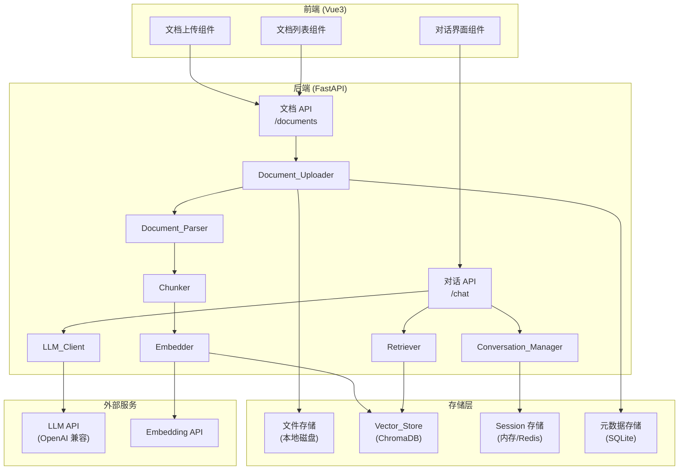

# 技术设计文档：内部知识库

## Overview

本系统是一个基于 RAG（检索增强生成）架构的内部知识库应用，允许用户上传文档并通过自然语言进行智能问答。系统支持多轮对话上下文记忆，能够结合历史对话和检索到的文档片段生成准确、连贯的回答。

技术栈：
- 前端：Vue 3 + TypeScript + Vite
- 后端：Python + FastAPI
- 向量数据库：ChromaDB（本地持久化，可替换为 FAISS）
- LLM：OpenAI 兼容接口（通过 HTTP API 调用）
- 文档解析：PyMuPDF（PDF）、python-docx（DOCX）、内置（TXT/Markdown）
- Agent 框架：LangChain + LangGraph（Embedder、LLM 调用、RAG 流程编排）
- 向量化：LangChain Embeddings（sentence-transformers 或 OpenAI 后端）

---

## Architecture

系统采用前后端分离架构，后端以 FastAPI 提供 RESTful API 和 SSE 流式接口，前端 Vue3 通过 HTTP 与后端通信。



### 核心数据流

**文档上传流程：**
```
用户上传文件 → 格式/大小校验 → 保存原始文件 → 异步解析 → 文本切分 → 向量化 → 存入 ChromaDB → 更新文档状态
```

**问答流程：**
```
用户提问 → 问题向量化 → 检索 Top-5 Chunks → 拼装 Prompt（历史对话 + Chunks + 问题）→ 调用 LLM → 流式返回答案
```

---

## Components and Interfaces

### 后端 API 接口

#### 文档管理

```
POST   /api/documents/upload          上传文档
GET    /api/documents                 获取文档列表
DELETE /api/documents/{doc_id}        删除文档
GET    /api/documents/{doc_id}/status 查询文档处理状态
```

#### 对话

```
POST   /api/chat/sessions                              创建新 Session
GET    /api/chat/sessions                              获取 Session 列表（按最后活跃时间倒序）
DELETE /api/chat/sessions/{session_id}                 删除 Session
POST   /api/chat/sessions/{session_id}/messages        发送消息（SSE 流式响应）
DELETE /api/chat/sessions/{session_id}/history         清除对话历史
GET    /api/chat/sessions/{session_id}/messages        获取历史消息
```

### 核心模块接口（Python）

```python
# Document_Parser
class DocumentParser:
    def parse(self, file_path: str, file_type: str) -> ParsedDocument: ...

# Chunker
class Chunker:
    def chunk(self, doc: ParsedDocument, max_tokens: int = 512, overlap: int = 50) -> list[Chunk]: ...

# Embedder
class Embedder:
    def embed(self, texts: list[str]) -> list[list[float]]: ...

# Retriever
class Retriever:
    def retrieve(self, query: str, top_k: int = 5) -> list[ChunkResult]: ...

# LLM_Client
class LLMClient:
    def stream_chat(self, prompt: str) -> Iterator[str]: ...

# Conversation_Manager
class ConversationManager:
    def get_session(self, session_id: str) -> Session: ...
    def add_message(self, session_id: str, role: str, content: str) -> None: ...
    def clear_history(self, session_id: str) -> None: ...
    def get_recent_history(self, session_id: str, n: int = 10) -> list[Message]: ...
```

### 前端组件

```
src/
  components/
    DocumentUpload.vue     文件选择、上传进度、状态展示
    DocumentList.vue       已上传文档列表、删除操作
    ChatInterface.vue      对话输入框、消息列表、流式展示
    MessageBubble.vue      单条消息气泡（含来源引用）
  stores/
    documents.ts           文档状态管理（Pinia）
    chat.ts                对话状态管理（Pinia）
  api/
    documents.ts           文档相关 API 调用
    chat.ts                对话相关 API 调用（含 SSE）
```

---

## Data Models

### ParsedDocument（核心内部表示）

```python
@dataclass
class ParsedDocument:
    doc_id: str                    # 文档唯一标识
    filename: str                  # 原始文件名
    file_type: str                 # pdf | docx | txt | md
    content: str                   # 解析后的纯文本内容
    paragraphs: list[str]          # 段落列表（保留结构）
    metadata: dict[str, Any]       # 扩展元数据（页数、作者等）
    parsed_at: datetime            # 解析时间戳
```

序列化为 JSON 的字段映射与 dataclass 字段一一对应，`datetime` 序列化为 ISO 8601 字符串。

### Chunk

```python
@dataclass
class Chunk:
    chunk_id: str       # 唯一标识
    doc_id: str         # 所属文档 ID
    content: str        # 片段文本
    token_count: int    # token 数量
    position: int       # 在文档中的顺序索引
```

### Document（元数据，存储于 SQLite）

```python
class Document(Base):
    id: str             # UUID
    filename: str
    file_type: str
    file_size: int      # bytes
    status: str         # pending | processing | ready | failed
    error_msg: str | None
    uploaded_at: datetime
    processed_at: datetime | None
```

### Session / Message

```python
@dataclass
class Message:
    role: str           # user | assistant
    content: str
    timestamp: datetime
    sources: list[SourceRef] | None   # 引用来源（仅 assistant）

@dataclass
class SourceRef:
    doc_id: str
    filename: str
    chunk_position: int

@dataclass
class Session:
    session_id: str
    title: str                  # 取首条用户消息前 20 字，默认"新对话"
    messages: list[Message]
    created_at: datetime
    last_active: datetime
```

Session 元数据（session_id、title、created_at、last_active）持久化到 SQLite，消息列表序列化为 JSON 存储在同一张表中。

### 前端类型（TypeScript）

```typescript
interface Document {
  id: string
  filename: string
  fileType: string
  fileSize: number
  status: 'pending' | 'processing' | 'ready' | 'failed'
  uploadedAt: string
}

interface SessionMeta {
  sessionId: string
  title: string
  createdAt: string
  lastActive: string
}

interface Message {
  role: 'user' | 'assistant'
  content: string
  sources?: SourceRef[]
}

interface SourceRef {
  docId: string
  filename: string
  chunkPosition: number
}
```

### 前端组件

```
src/
  components/
    DocumentUpload.vue     文件选择、上传进度、状态展示
    DocumentList.vue       已上传文档列表、删除操作（含二次确认弹窗）
    ConfirmDialog.vue      通用二次确认对话框组件
    ChatInterface.vue      对话输入框、消息列表、流式展示
    MessageBubble.vue      单条消息气泡（含来源引用）
    SessionList.vue        历史会话列表、新建会话按钮
  views/
    ChatView.vue           问答页（左侧 SessionList + 右侧 ChatInterface）
    DocsView.vue           文档管理页（左侧上传 + 右侧列表）
  stores/
    documents.ts           文档状态管理（Pinia）
    chat.ts                对话状态管理（含多会话切换，Pinia）
  api/
    documents.ts           文档相关 API 调用
    chat.ts                对话相关 API 调用（含 SSE、Session 列表）
```

---

## Correctness Properties

*A property is a characteristic or behavior that should hold true across all valid executions of a system — essentially, a formal statement about what the system should do. Properties serve as the bridge between human-readable specifications and machine-verifiable correctness guarantees.*

### Property 1: 文件格式校验完备性

*For any* 文件扩展名，Document_Uploader 的格式校验函数应当且仅当扩展名属于 {pdf, docx, txt, md} 集合时返回合法，否则返回非法并在错误信息中包含支持格式列表。

**Validates: Requirements 1.2, 1.3**

---

### Property 2: 文档列表字段完整性

*For any* 已上传的文档集合，调用文档列表接口返回的每条记录都应包含文档名称（filename）、上传时间（uploadedAt）和处理状态（status）字段，且字段值与存储的元数据一致。

**Validates: Requirements 1.6**

---

### Property 3: 删除一致性

*For any* 已成功上传并向量化的文档，执行删除操作后，文件存储、元数据存储和 Vector_Store 中均不应存在该文档的任何数据（原始文件、元数据记录、Chunk 向量全部清除）。

**Validates: Requirements 1.7, 2.6**

---

### Property 4: 解析输出完整性

*For any* 有效的 PDF、DOCX、TXT 或 Markdown 文件，Document_Parser 解析后应返回一个 ParsedDocument 对象，其 content 字段非空，paragraphs 列表非空，file_type 字段与输入格式匹配。

**Validates: Requirements 2.1, 2.5, 5.1**

---

### Property 5: Chunk 大小约束

*For any* 文本内容，Chunker 切分后的每个 Chunk 的 token 数量不超过 512，且对于长度超过 512 token 的文本，相邻 Chunk 之间存在不少于 50 个 token 的重叠内容。

**Validates: Requirements 2.2**

---

### Property 6: 向量化存储往返

*For any* 文本 Chunk，经 Embedder 向量化并存入 Vector_Store 后，使用该 Chunk 的原始文本作为查询，Retriever 应能在结果中检索到该 Chunk（相似度最高的结果应包含该 Chunk）。

**Validates: Requirements 2.3**

---

### Property 7: 解析错误状态标记

*For any* 会导致解析失败的输入（如损坏的文件内容），Document_Parser 应将对应文档状态标记为 "failed"，而不是抛出未捕获的异常。

**Validates: Requirements 2.4**

---

### Property 8: RAG Prompt 构造完整性

*For any* 用户查询，当 Vector_Store 中存在相关文档时，构造的 Prompt 应同时包含：检索到的 Chunk 内容（不超过 5 个）、用户当前问题，以及最近不超过 10 轮的对话历史。

**Validates: Requirements 3.1, 3.2, 4.2**

---

### Property 9: 回答来源引用

*For any* 基于检索结果生成的回答，响应对象的 sources 字段应包含所有被引用 Chunk 的文档名称和片段位置信息，且 sources 列表非空。

**Validates: Requirements 3.3**

---

### Property 10: 流式输出格式

*For any* 问答请求，Chat API 的响应应为 SSE（Server-Sent Events）格式，即响应头 Content-Type 为 `text/event-stream`，且数据以多个 `data:` 事件块的形式逐步推送，而非一次性返回完整响应体。

**Validates: Requirements 3.6**

---

### Property 11: Session 隔离性

*For any* 两个不同的 Session，向其中一个 Session 添加消息后，另一个 Session 的历史记录不应受到影响（历史消息数量和内容保持不变）。

**Validates: Requirements 4.1**

---

### Property 12: Session 生命周期

*For any* Session，在其最后活跃时间超过 30 分钟后，Conversation_Manager 应将该 Session 的对话历史标记为已过期或清空；在超时前，历史记录应始终可访问。

**Validates: Requirements 4.3, 4.5**

---

### Property 13: 清除历史往返

*For any* 包含若干条消息的 Session，执行清除历史操作后，该 Session 的消息列表应为空，且后续新增的消息从索引 0 开始重新计数。

**Validates: Requirements 4.4**

---

### Property 14: ParsedDocument 序列化往返

*For any* 有效的 ParsedDocument 对象，将其序列化为 JSON 字符串后再反序列化，应得到与原对象内容等价的 ParsedDocument 对象（所有字段值相等）。

**Validates: Requirements 5.2**

---

### Property 15: 解析幂等性

*For any* 有效的文档文件，对同一文件执行两次解析，两次返回的 ParsedDocument 对象的 content 和 paragraphs 字段应内容等价。

**Validates: Requirements 5.3**

---

## Error Handling

| 错误场景 | 处理方式 | HTTP 状态码 |
|---|---|---|
| 不支持的文件格式 | 返回错误信息，包含支持格式列表 | 400 |
| 文件大小超过 50MB | 返回大小限制提示 | 413 |
| 文档解析失败 | 记录日志，文档状态置为 failed，通知用户 | 200（异步，状态轮询） |
| Vector_Store 无相关内容 | 返回提示信息，建议上传相关文档 | 200（业务层处理） |
| LLM API 调用失败 | 返回服务暂时不可用提示，记录错误日志 | 503 |
| Session 不存在 | 返回 Session 未找到错误 | 404 |
| 删除不存在的文档 | 返回文档未找到错误 | 404 |

**异步处理错误：** 文档解析和向量化为异步流程，错误通过文档状态字段（status: failed + error_msg）反馈，前端通过轮询或 WebSocket 获取最新状态。

**LLM 调用容错：** LLM_Client 应实现重试机制（最多 3 次，指数退避），超时时间设为 30 秒。

---

## Testing Strategy

### 双轨测试方法

系统采用单元测试和属性测试相结合的方式，两者互补，共同保证正确性。

**单元测试（具体示例）：**
- 验证各文件格式的解析示例（PDF/DOCX/TXT/MD 各一个典型文件）
- 验证空文件输入返回空 ParsedDocument 而非异常（需求 5.4 边界条件）
- 验证文件大小超过 50MB 时被拒绝（需求 1.4 边界条件）
- 验证知识库为空时返回"未找到相关内容"提示（需求 3.4 边界条件）
- 验证 Session 历史接口返回正确格式的消息列表（需求 4.6）
- 验证上传入口在前端页面中存在（需求 1.1）

**属性测试（普遍规律）：**
- 使用 [Hypothesis](https://hypothesis.readthedocs.io/)（Python）进行后端属性测试
- 每个属性测试最少运行 100 次迭代
- 每个属性测试必须通过注释标注对应的设计属性编号

属性测试标注格式：
```python
# Feature: internal-knowledge-base, Property {N}: {property_text}
```

### 属性测试实现要点

```python
from hypothesis import given, settings
from hypothesis import strategies as st

# Feature: internal-knowledge-base, Property 14: ParsedDocument 序列化往返
@given(st.from_type(ParsedDocument))
@settings(max_examples=100)
def test_parsed_document_roundtrip(doc: ParsedDocument):
    serialized = doc.to_json()
    restored = ParsedDocument.from_json(serialized)
    assert restored == doc

# Feature: internal-knowledge-base, Property 5: Chunk 大小约束
@given(st.text(min_size=1))
@settings(max_examples=100)
def test_chunk_size_constraint(text: str):
    chunks = chunker.chunk(ParsedDocument(..., content=text, ...), max_tokens=512, overlap=50)
    assert all(c.token_count <= 512 for c in chunks)

# Feature: internal-knowledge-base, Property 15: 解析幂等性
@given(st.binary())  # 随机文件内容
@settings(max_examples=100)
def test_parse_idempotent(content: bytes):
    # 仅对有效文件内容测试
    result1 = parser.parse_text(content)
    result2 = parser.parse_text(content)
    assert result1.content == result2.content
```

### 测试覆盖范围

| 属性编号 | 测试类型 | 测试目标 |
|---|---|---|
| Property 1 | 属性测试 | 文件格式校验完备性 |
| Property 2 | 属性测试 | 文档列表字段完整性 |
| Property 3 | 属性测试 | 删除一致性 |
| Property 4 | 属性测试 | 解析输出完整性 |
| Property 5 | 属性测试 | Chunk 大小约束 |
| Property 6 | 属性测试 | 向量化存储往返 |
| Property 7 | 属性测试 | 解析错误状态标记 |
| Property 8 | 属性测试 | RAG Prompt 构造完整性 |
| Property 9 | 属性测试 | 回答来源引用 |
| Property 10 | 属性测试 | 流式输出格式 |
| Property 11 | 属性测试 | Session 隔离性 |
| Property 12 | 属性测试 | Session 生命周期 |
| Property 13 | 属性测试 | 清除历史往返 |
| Property 14 | 属性测试 | ParsedDocument 序列化往返 |
| Property 15 | 属性测试 | 解析幂等性 |
| 需求 1.1 | 单元测试（示例） | 上传入口存在 |
| 需求 1.4 | 单元测试（边界） | 50MB 大小限制 |
| 需求 3.4 | 单元测试（边界） | 空知识库提示 |
| 需求 4.6 | 单元测试（示例） | 历史记录接口 |
| 需求 5.4 | 单元测试（边界） | 空文档优雅处理 |
